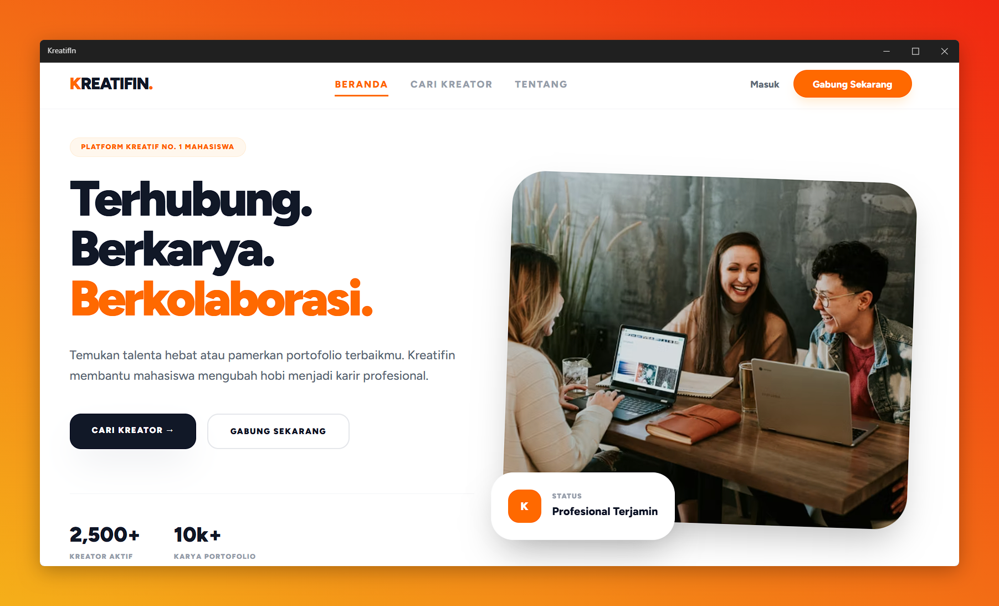

# 🚀 KREATIFIN.
> **KreatifIn** adalah solusi digital yang dirancang untuk menjembatani kebutuhan kolaborasi di ekosistem kreatif. Platform ini mengutamakan estetika minimalis, keamanan data, dan kecepatan akses.

---

### 📱 Preview Project

================================================================================
                A C A D E M I C   P R O J E C T   D O C U M E N T
================================================================================
Project Name    : KREATIFIN. - Wujudkan Ide, Jalin Kolaborasi.
Purpose         : Tugas UAS Mata Kuliah Pemrograman Web
Class           : 5C
Study Program   : Informatika
Faculty         : Teknologi Informasi
University      : Universitas Sebelas April (UNSAP)
Version         : 1.0.0-Stable
URL             : https://www.kreatif-in.my.id/
================================================================================

[ 1. OVERVIEW ]
KreatifIn adalah solusi digital berbasis web yang dirancang untuk menjembatani 
kebutuhan kolaborasi di ekosistem kreatif. Platform ini mengutamakan 
estetika minimalis, keamanan data, dan kecepatan akses bagi pengguna.

[ 2. PROJECT TEAM & ROLES ]
- Iqbal Fadillah         : Lead Developer & Full-Stack Engineer
- Harfin Akmal Safari    : Project Manager 
- Andre Raka Fadhillah   : Marketing & Research
- Fajri Fauzan Baihaqi   : Content & Communication
- Gingin Ginanjar        : UI/UX Designer

[ 3. KEY FEATURES ]
- Unified Authentication    : Sistem login tunggal menggunakan Laravel Breeze.
- Responsive Interface      : Kompatibilitas penuh di berbagai ukuran layar.
- Error Management          : Penanganan exception 404 & 500 kustom yang user-friendly.
- Secure Middleware         : Proteksi rute halaman untuk mencegah akses ilegal.
- Optimization              : Konfigurasi cache server untuk performa maksimal.

[ 4. SYSTEM ARCHITECTURE ]
- Backend Framework    : Laravel 12.x
- Frontend Engine      : Blade Templating & Tailwind CSS 3.x
- Language             : PHP 8.2
- Web Server           : LiteSpeed / Apache (Shared Hosting)
- Database             : MariaDB / MySQL 10.x

[ 5. DIRECTORY STRUCTURE (Key Folders) ]
/app             -> Logika inti aplikasi (Models & Controllers)
/resources       -> File tampilan (Blade Views) & aset CSS/JS
/routes          -> Definisi URL dan endpoint aplikasi
/public          -> Titik masuk utama (Index.php & Assets)
/database        -> Skema tabel dan migrasi data

[ 6. USER JOURNEY (Panduan Pengguna) ]
1. Landing Page: User disambut dengan value proposition utama.
2. Get Started : User diarahkan ke halaman Register untuk pembuatan akun.
3. Dashboard   : Setelah verifikasi, user masuk ke ruang kerja personal.
4. Navigation  : Akses cepat melalui Sidebar/Navbar yang intuitif.
5. Exit        : Proses Logout aman yang membersihkan sesi (session) user.

[ 7. MAINTENANCE & SECURITY ]
- Debug Mode dipastikan NON-AKTIF (APP_DEBUG=false) untuk keamanan.
- Keamanan password menggunakan hashing algoritma Bcrypt.
- Proteksi CSRF (Cross-Site Request Forgery) pada setiap input form.

--------------------------------------------------------------------------------
© 2026 KREATIFIN Project - Universitas Sebelas April.
--------------------------------------------------------------------------------